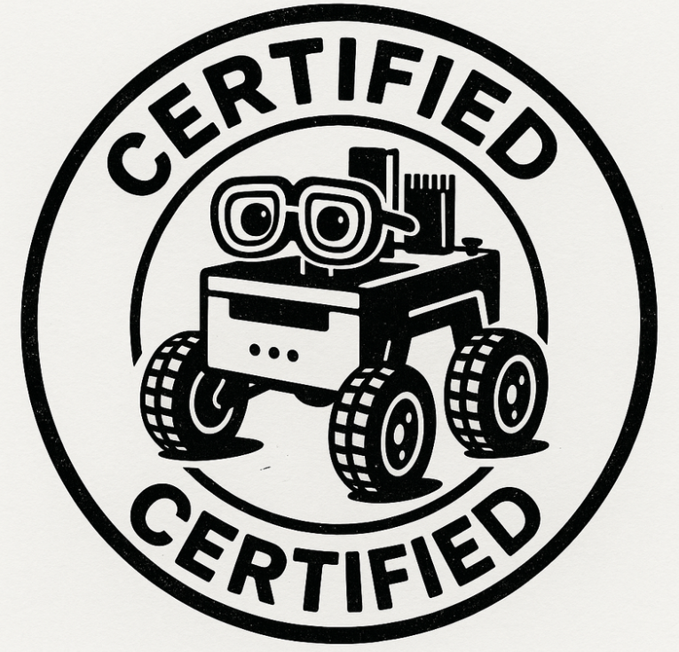

# DARA – Disaster Assistance via Robotic Autonomy

DARA is an autonomous multi-platform system designed to enhance emergency healthcare delivery during crises. Developed for the 9th CASSINI Hackathon: Space for Healthcare, DARA integrates drones, ground robots, and maritime vehicles into a coordinated ecosystem. Utilizing real-time data from satellites, IoT sensors, and multispectral imaging, DARA autonomously navigates disaster zones to deliver medical supplies, assess environmental risks, and support rescue operations. Its AI-driven approach ensures rapid, efficient, and scalable responses to emergencies.

